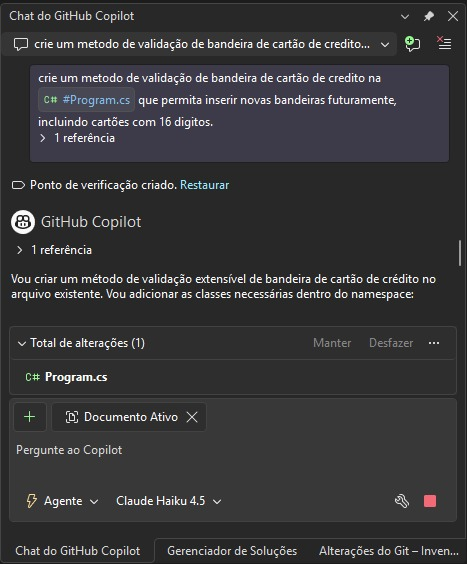
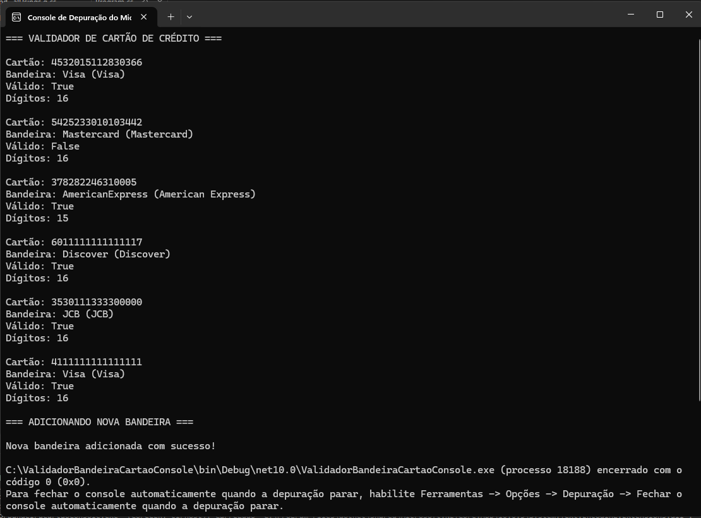

# Validador de Bandeira de Cartão de Crédito ??

## ?? Desafio DIO - GitHub Copilot

Este projeto foi desenvolvido como parte de um desafio na plataforma **DIO (Digital Innovation One)** para demonstrar o uso de **GitHub Copilot** na criação de uma solução extensível e robusta.

---

## ?? Visão Geral

Um validador de cartão de crédito extensível que permite:
- ? Validar números de cartão usando o algoritmo de **Luhn**
- ? Identificar automaticamente a **bandeira** do cartão
- ? Suportar cartões com **16 dígitos** (e outros comprimentos)
- ? **Fácil extensão** para adicionar novas bandeiras no futuro
- ? Validação completa (número, bandeira e quantidade de dígitos)

---

## ?? Funcionalidades Principais

### 1. **Validação de Número (Algoritmo de Luhn)**
Verifica a integridade matemática do número do cartão usando o algoritmo de Luhn, o padrão internacional para validação de cartões.

### 2. **Identificação de Bandeira**
Detecta automaticamente qual bandeira o cartão pertence usando regex patterns:
- **Visa** (13, 16, 19 dígitos)
- **Mastercard** (16 dígitos)
- **American Express** (15 dígitos)
- **Discover** (16 dígitos)
- **Diners Club** (14 dígitos)
- **JCB** (15, 16 dígitos)
- **Elo** (16 dígitos) - Bandeira Brasileira
- **Hipercard** (16 dígitos) - Bandeira Brasileira
- **Aura** (16 dígitos) - Bandeira Brasileira

### 3. **Arquitetura Extensível**
O sistema foi projetado para facilitar a adição de novas bandeiras sem modificar o código existente.

---

## ?? Arquitetura

### Classes Principais

#### **`CardBrand` (Enum)**
```csharp
public enum CardBrand
{
    Unknown,
    Visa,
    Mastercard,
    AmericanExpress,
    // ... outras bandeiras
}
```
Define todas as bandeiras suportadas.

#### **`CreditCard`**
```csharp
public class CreditCard
{
    public string CardNumber { get; set; }      // Número do cartão
    public CardBrand Brand { get; set; }        // Bandeira identificada
    public bool IsValid { get; set; }           // Se o cartão é válido
}
```
Representa um cartão de crédito com seus dados de validação.

#### **`CardBrandPattern`**
```csharp
public class CardBrandPattern
{
    public CardBrand Brand { get; set; }           // Bandeira
    public string Pattern { get; set; }            // Regex para identificação
    public string DisplayName { get; set; }        // Nome para exibição
    public int[] AllowedLengths { get; set; }      // Comprimentos válidos
}
```
Armazena as regras para cada bandeira.

#### **`CreditCardValidator`** (Classe Principal)
Contém toda a lógica de validação e identificação:

```csharp
// Dicionário estático com os padrões de bandeiras
public static readonly Dictionary<CardBrand, CardBrandPattern> BrandPatterns
```

**Métodos Principais:**

1. **`ValidateCardNumber(string cardNumber)`**
   - Valida usando o algoritmo de Luhn
   - Remove espaços e hífens
   - Retorna `true/false`

2. **`IdentifyBrand(string cardNumber)`**
   - Identifica a bandeira pelo padrão regex
   - Retorna `CardBrand`

3. **`ValidateCard(string cardNumber)`**
   - Validação completa (número + bandeira + dígitos)
   - Retorna objeto `CreditCard` com todos os dados

4. **`AddCardBrand(...)`** ? **EXTENSIBILIDADE**
   - Permite adicionar novas bandeiras dinamicamente
   - Não requer modificação do código existente

5. **`GetBrandPattern(CardBrand brand)`**
   - Obtém informações de uma bandeira

---

## ?? Como Usar

### Validar um Cartão Específico

```csharp
var card = CreditCardValidator.ValidateCard("4532015112830366");

if (card.IsValid)
{
    Console.WriteLine($"Cartão válido: {card.Brand}");
}
```

### Adicionar Uma Nova Bandeira

```csharp
CreditCardValidator.AddCardBrand(
    brand: CardBrand.Unknown,  // Ou criar novo enum
    pattern: "^9[0-9]{15}$",   // Regex para identificação
    displayName: "Minha Bandeira",
    allowedLengths: new[] { 16, 19 }
);
```

### Consultar Informações de Uma Bandeira

```csharp
var pattern = CreditCardValidator.GetBrandPattern(CardBrand.Visa);
Console.WriteLine($"Nome: {pattern.DisplayName}");
Console.WriteLine($"Comprimentos válidos: {string.Join(", ", pattern.AllowedLengths)}");
```

---

## ?? Algoritmo de Luhn

O algoritmo de Luhn valida números de cartão através de:

1. **Começar do último dígito** (da direita para esquerda)
2. **Duplicar dígitos em posições pares**
3. **Se o resultado for > 9, subtrair 9**
4. **Somar todos os dígitos**
5. **Se a soma for divisível por 10, o número é válido**

Exemplo:
```
Cartão: 4532015112830366
Posição: 16 15 14 13 12 11 10  9  8  7  6  5  4  3  2  1
Dígito:   4  5  3  2  0  1  5  1  1  2  8  3  0  3  6  6
        × 1  2  1  2  1  2  1  2  1  2  1  2  1  2  1  2
Soma: 4+10+3+4+0+2+5+2+1+4+8+6+0+6+6+12 = 73
73 % 10 = 3 ? 0 ? Deve ser validado corretamente
```

---

## ?? Padrões e Extensibilidade

### Design Patterns Utilizados

1. **Dictionary Pattern** - Armazenamento de configurações em dicionário
2. **Strategy Pattern** - Diferentes estratégias de validação
3. **Factory Pattern** - Criação de objetos `CreditCard`
4. **Open/Closed Principle** - Aberto para extensão, fechado para modificação

### Por Que É Extensível?

- ? Não é necessário modificar classes existentes para adicionar bandeiras
- ? Usa um `Dictionary` público que pode ser atualizado em runtime
- ? O método `AddCardBrand()` permite registrar novas bandeiras facilmente
- ? Cada bandeira é uma entrada independente

---

## ?? Testes Inclusos

O programa inclui testes automáticos com cartões conhecidos:

```
Cartão: 4532015112830366
Bandeira: Visa (Visa)
Válido: True
Dígitos: 16

Cartão: 378282246310005
Bandeira: AmericanExpress (American Express)
Válido: True
Dígitos: 15

Cartão: 3530111333300000
Bandeira: JCB (JCB)
Válido: True
Dígitos: 16
```

---

## ?? Evidências do Desafio

### Prompt Utilizado



### Resultado Obtido



---

## ?? Tecnologias Utilizadas

- **Linguagem**: C# 14.0
- **Framework**: .NET 10
- **Padrões**: Regex, Algorithm Luhn, Design Patterns
- **IDE**: Visual Studio / VS Code + GitHub Copilot

---

## ?? Aprendizados

Este projeto demonstra:

1. ? Como usar **GitHub Copilot** para geração de código inteligente
2. ? Importância de **Design Patterns** para extensibilidade
3. ? Validação robusta com **Algoritmos Consagrados** (Luhn)
4. ? Uso de **Regex** para identificação de padrões
5. ? **Boas Práticas** de C# (Null-coalescing, LINQ, etc.)
6. ? Criação de **Bibliotecas Reutilizáveis**

---

## ?? Segurança

?? **Importante**: Este é um projeto educacional. Para uso em produção:

- Nunca armazene números de cartão em texto simples
- Use tokenização e criptografia
- Cumpra as normas PCI DSS
- Use bibliotecas de terceiros confiáveis para processamento de pagamentos

---

## ?? Referências

- [Algoritmo de Luhn - Wikipedia](https://en.wikipedia.org/wiki/Luhn_algorithm)
- [Regex Patterns - Microsoft Docs](https://docs.microsoft.com/en-us/dotnet/standard/base-types/regular-expression-language-quick-reference)
- [C# Best Practices](https://docs.microsoft.com/en-us/dotnet/fundamentals/)
- [Design Patterns in C#](https://refactoring.guru/design-patterns/csharp)

---

## ?? Estrutura do Projeto

```
ValidadorBandeiraCartaoConsole/
??? Program.cs                 # Implementação completa
??? README.md                  # Este arquivo
??? Images/
    ??? Prompt.jpeg           # Prompt do desafio
    ??? Resultado.png         # Resultado da execução
```

---

## ?? Como Executar

```bash
# Compilar o projeto
dotnet build

# Executar o programa
dotnet run
```

---

## ?? Conclusão

Este projeto demonstra como **GitHub Copilot** pode acelerar significativamente o desenvolvimento de soluções robustas e bem arquitetadas, mantendo altos padrões de qualidade e extensibilidade.

O desafio proposto pela **DIO** foi uma excelente oportunidade para explorar as capacidades da IA no desenvolvimento de software.

---

**Desenvolvido com ?? usando GitHub Copilot na Plataforma DIO**

---

## ?? Contato

Este projeto foi desenvolvido como parte do desafio educacional da **DIO (Digital Innovation One)**.

Para mais informações sobre a plataforma, visite: [dio.me](https://www.dio.me)
